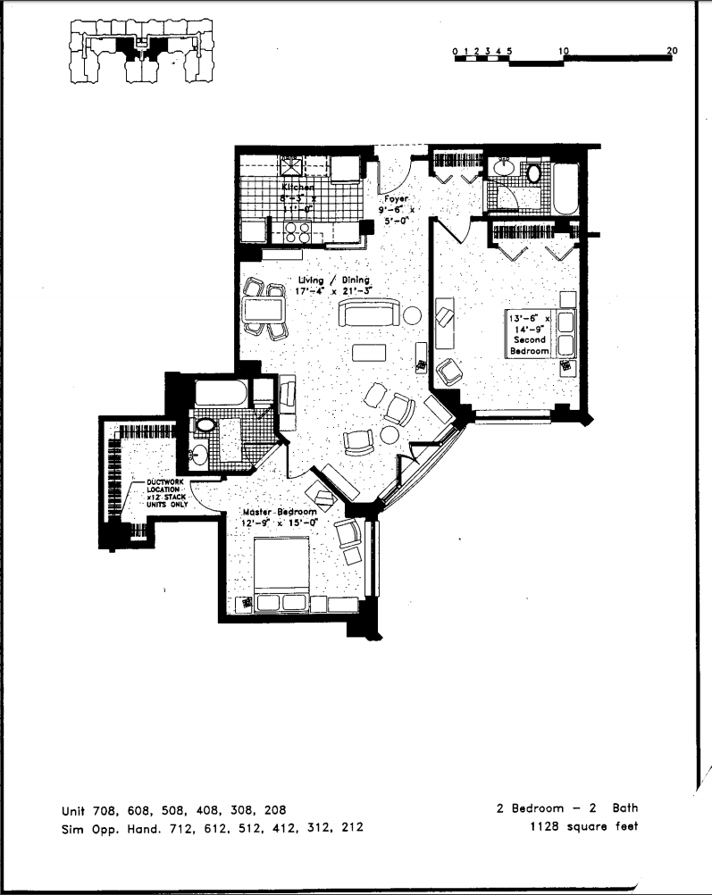
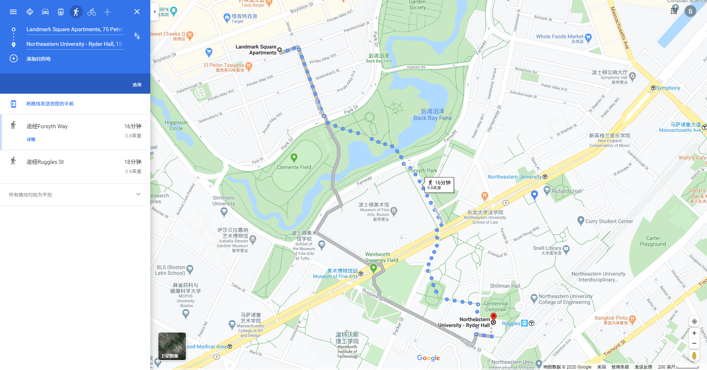
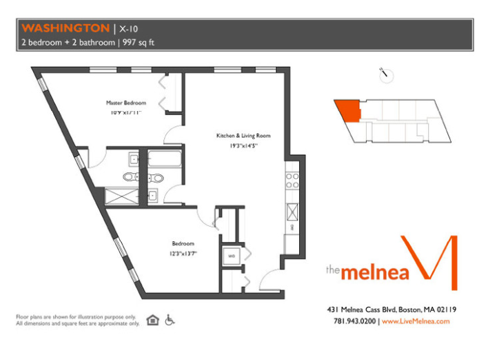
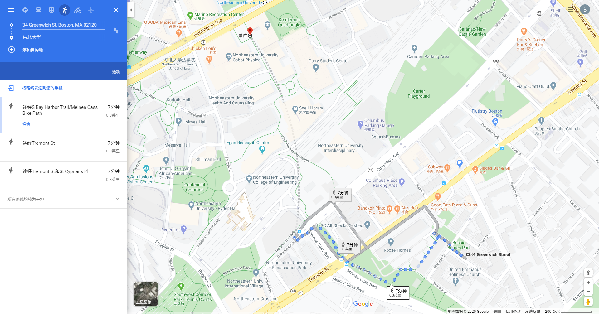

# Apartment <!-- omit in toc -->


因为我一开始也没注意这个宠物政策的问题，给大家造成了不方便。

然后我根据咱们已经找好的landmark公寓，对比又找了一些pet friendly的公寓。

## 总览-价格对比 <!-- omit in toc -->

|公寓|总价 $|大小 Sq Ft|
|--|--|--|
Landmark 2b2b 目前的| 3,672 （折后总价）| 1123
Greenwich 2b2b| 3,499|992
12 Blackwood St Unit 410 2b2b 有个室外阳台| 3,750|800
656 Massachusetts Ave Unit 1 有个庭院|3,200|800

- [Landmark 2b2b 目前的](#landmark-2b2b-目前的)
  - [户型图](#户型图)
  - [距离学校](#距离学校)
  - [价格](#价格)
- [Greenwich 2b2b](#greenwich-2b2b)
  - [户型图](#户型图-1)
  - [室内](#室内)
  - [距离学校](#距离学校-1)
  - [价格](#价格-1)
- [12 Blackwood St Unit 410 2b2b 有个室外阳台](#12-blackwood-st-unit-410-2b2b-有个室外阳台)
  - [室内](#室内-1)
  - [距离学校](#距离学校-2)
  - [价格](#价格-2)
- [656 Massachusetts Ave Unit 1 2b2b 带个室外庭院](#656-massachusetts-ave-unit-1-2b2b-带个室外庭院)
  - [室内](#室内-2)
  - [距离学校](#距离学校-3)
  - [价格](#价格-3)

## Landmark 2b2b 目前的

现在咱们找的是这个

### 户型图



### 距离学校



### 价格

3,672（折后总价） $ | 1123 Sq Ft

|主卧|副卧|客厅
|--|--|--|
1633（1360）|1429（1190）|1122（935）

## Greenwich 2b2b

[参考网页](https://www.apartments.com/the-melnea-residences-boston-ma/fn7pefr/)

房间：410

这个房间我看是目前所有2b2b里面最大的

我看是有室内洗衣机和烘干机，户型图里面那个```WD```应该就是所在的位置

### 户型图



### 室内


### 距离学校



### 价格

3,499 $ | 992 Sq Ft

## 12 Blackwood St Unit 410 2b2b 有个室外阳台

[参考网页](https://www.apartments.com/12-blackwood-st-boston-ma-unit-410/prpk8nt/)

好像没有室内洗衣烘干 待确认

### 室内


阳台和客厅连着


### 距离学校


### 价格

3,750 $ | 800 Sq Ft

## 656 Massachusetts Ave Unit 1 2b2b 带个室外庭院

室内有洗衣烘干

还有个庭院

[参考网页](https://www.apartments.com/656-massachusetts-ave-boston-ma-unit-1/p4w8t2s/)

### 室内


### 距离学校


### 价格

3,200 $|800 Sq Ft